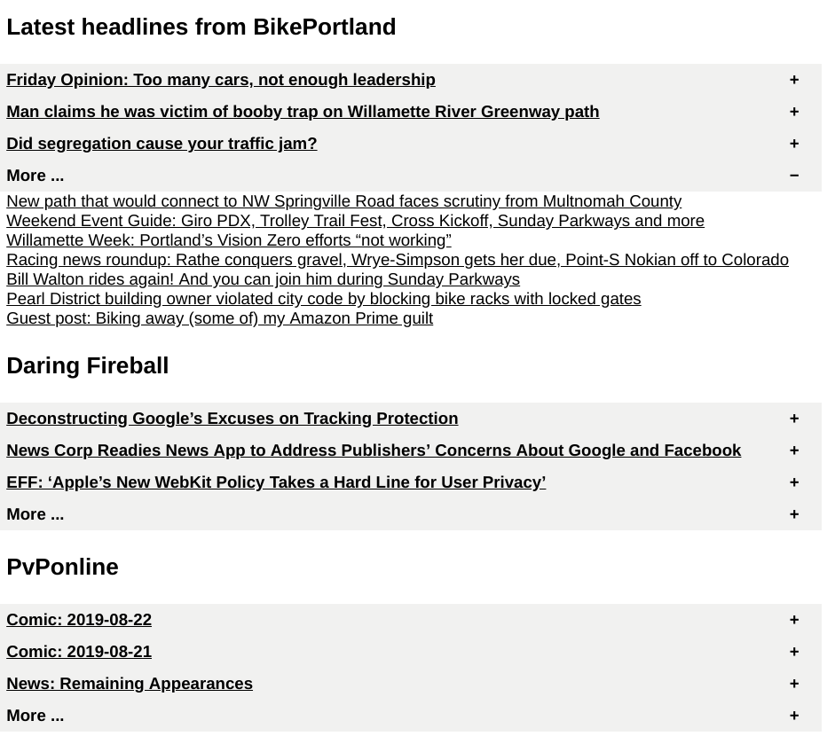

Python RSS reader
#################

Quick and dirty rss aggregator to html file with collapsible sections.

   Figure 1: How it looks with the 1st More section expanded

* uses feedparser to parse rss files: https://github.com/kurtmckee/feedparser
* prints out summary of first 3 results
* lists the rest under *more* section
* not optimized for performance
* source of rss urls is flat text file: 1 per line

To do:

* add ability to put user defined sections in rss source file